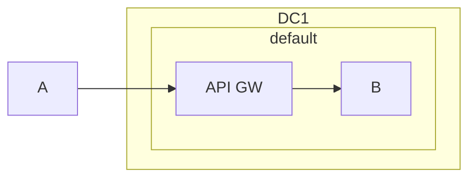
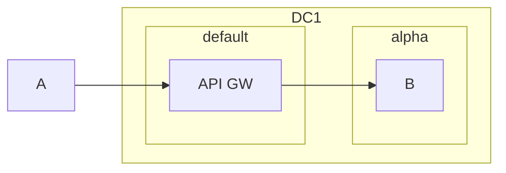
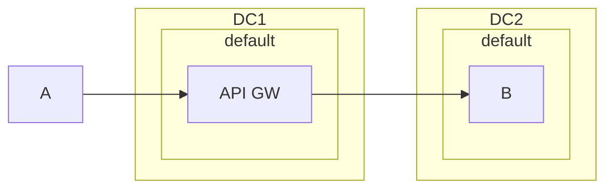

# Mesh Ingress

## Local

```mermaid
flowchart LR;

a["A"]
subgraph dc1["DC1"]
  subgraph dc1-default["default"]
    ing["API GW"]
    b["B"]
  end
end

a-->ing-->b
```

## Partition

```mermaid
flowchart LR;

a["A"]
subgraph dc1["DC1"]
  subgraph dc1-default["default"]
    ing["API GW"]
  end

  subgraph dc1-alpha["alpha"]
    b["B"]   
  end
end

a-->ing-->b
```

## Peer

```mermaid
flowchart LR;

a["A"]
subgraph dc1["DC1"]
  subgraph dc1-default["default"]
    ing["API GW"]
  end
end

subgraph dc2["DC2"]
  subgraph dc2-default["default"]
    b["B"]
  end
end

a-->ing-->b
```
