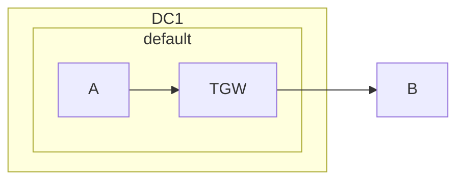
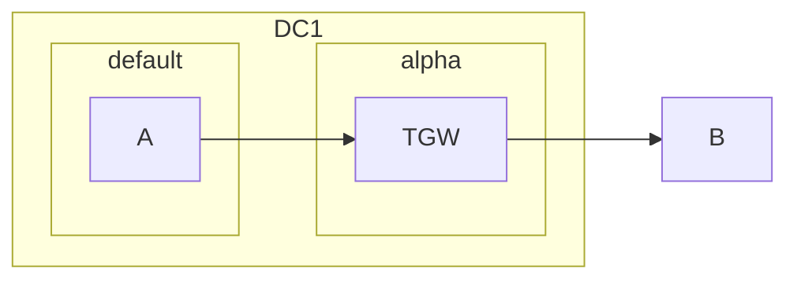
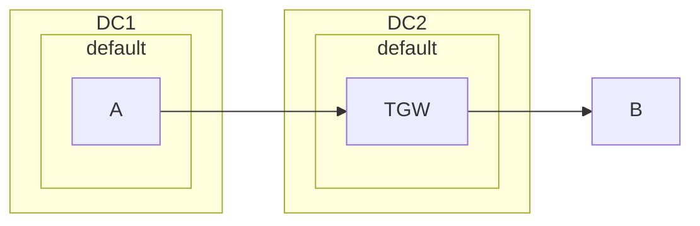

# Mesh Transit

## Local

```mermaid
flowchart LR;

subgraph dc1["DC1"]
  subgraph dc1-default["default"]
    a["A"]
    egr["TGW"]
  end
end
b["B"]

a-->egr-->b
```

## Partition

```mermaid
flowchart LR;

subgraph dc1["DC1"]
  subgraph dc1-default["default"]
    a["A"]
  end 

  subgraph dc1-alpha["alpha"]
    egr["TGW"]
  end   
end
b["B"]

a-->egr-->b
```

## Peer

```mermaid
flowchart LR;

subgraph dc1["DC1"]
  subgraph dc1-default["default"]
    a["A"]
  end
end

subgraph dc2["DC2"]
  subgraph dc2-default["default"]
    egr["TGW"]
  end 
end
b["B"]  

a-->egr-->b
```
